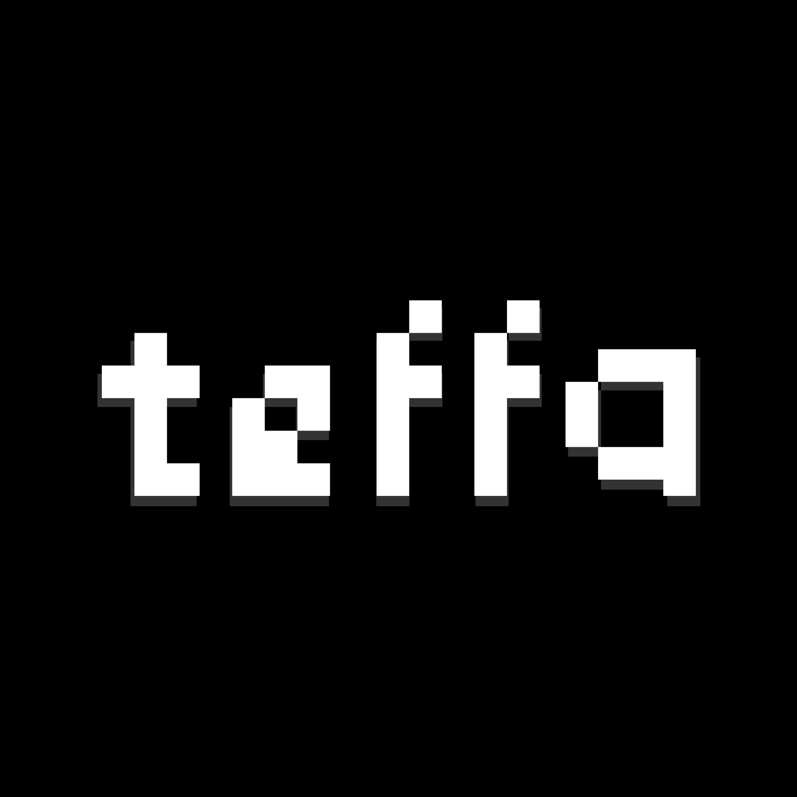

<p align="center">
  <picture>
    <source
      media="(prefers-color-scheme: dark)"
      srcset="./assets/branding/teffa-primary-dark-transparent-16x9.png"
    >
    <source
      media="(prefers-color-scheme: light)"
      srcset="assets/branding/teffa-primary-light-transparent-16x9.png"
    >
    
  </picture>
</p>

# TeffaCoreAPI

**Ngôn ngữ:** [English](README.md) | Tiếng Việt

---

## Tiếng Việt

TeffaCoreAPI là core plugin/API dành cho server Minecraft Paper trong hệ sinh thái plugin Teffa.

Plugin này cung cấp các service dùng chung cho những plugin Teffa khác, bao gồm hồ sơ người chơi, quyền hạn, chẩn đoán hệ thống và hệ thống kết nối/session cho TeffaClient.

> Trạng thái: Beta. Tính năng và cấu trúc API có thể thay đổi trong các phiên bản sau.

## Tính năng

* Hệ thống hồ sơ người chơi
* Lưu hồ sơ bằng JSON
* Permission service sử dụng LuckPerms
* Diagnostic service
* Hệ thống TeffaClient bridge/session
* Xử lý hồ sơ khi player vào/rời server
* Lệnh nền `/teffa`
* Nền tảng API cho các plugin Teffa khác

## Yêu cầu

* Paper 26.1.2
* Java 25
* Maven
* LuckPerms

## Cài đặt

1. Tải `LuckPerms`
2. Tải `TeffaCoreAPI`
3. Bỏ các file `.jar` vào thư mục `plugins/`
4. Khởi động lại server

## Build

```bash
mvn clean package
```

File `.jar` sau khi build sẽ nằm trong thư mục `target/`.

## Lệnh

| Lệnh                           | Quyền                        | Mô tả                                      |
| ------------------------------ | ---------------------------- | ------------------------------------------ |
| `/teffa clientstatus <player>` | `teffa.command.clientstatus` | Kiểm tra trạng thái TeffaClient của player |

## Cấu trúc dự án

```txt
TeffaCoreAPI/
├─ src/
│  └─ main/
│     ├─ java/
│     └─ resources/
│        └─ plugin.yml
├─ pom.xml
├─ .gitignore
└─ README.md
```

## Ghi chú

TeffaCoreAPI vẫn đang trong quá trình phát triển và có thể thay đổi trong các phiên bản sau.

TeffaCoreAPI là một phần của hệ sinh thái plugin Teffa, được phát triển cho server Minecraft Paper.

Dự án này được tạo và duy trì bởi Nguyễn Lê Anh.

Một số phần code được phát triển với sự hỗ trợ của AI.

Ý tưởng, thiết kế tính năng, kiểm thử và quyết định triển khai thuộc về tác giả.
